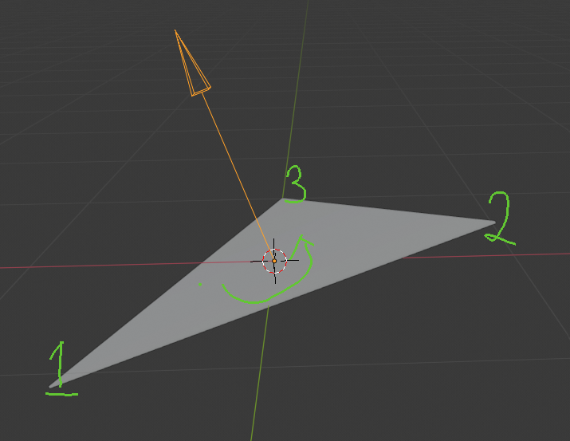

# Project 1 - Data structure of 3D model 

## Obj Format
```
# connect material or color information
mtllib oero.mtl

# vertex of x,y,z parameters
v 0.000000 0.000000 0.000000 
v 5.000000 0.000000 0.000000
...

# record the point on picture(connect by mtl file)
# origin on left down
vt 0.567547 0.963623 
vt 0.795419 0.963623 
...

# normalize vector on each vertex
vn  0.0000  0.0000 -1.0000
vn  0.0000 -1.0000  0.0000
...

# use material which record on oreo.mtl
usemtl oreo_box

# connect 3 points to triangle, each point contented by v/vt/vn
# f v1/vt1/vn1 v2/vt2/vn2 v2/vt2/vn2
# surface which on the same side with right-hand spiral rule of 3 points, this surfacde will be bight
# on the other hand, opposite surface will be dark and material surface will opposite too.
f 1/10/1 3/13/1 2/11/1
f 2/11/1 3/13/1 4/14/1
```
<br>

▲ obj format of face description

## Demo


👉 [Website Link](https://majaja068.github.io/Computer_Graphics/Project1/oreo.html)
