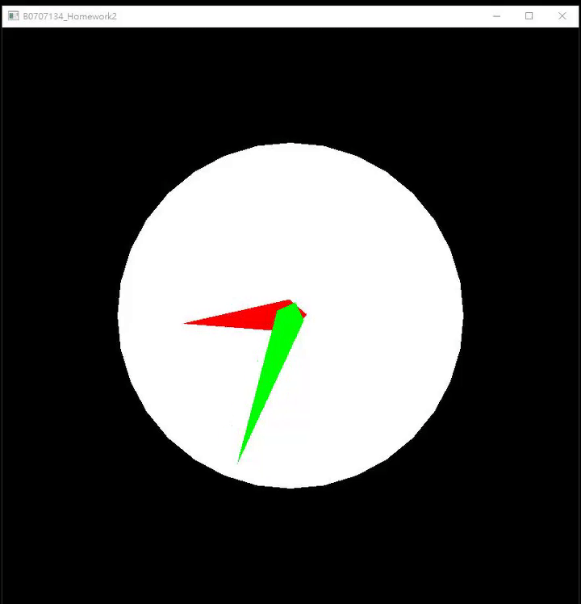

## Project 2 - Transformations: Translation, Rotation, and Scaling of 3D model

### position p in 2D

### Translation Matrix

### Rotation Matrix

### Scaling Matrix

### Example： Scale x3, then Rotate 30degree, then Offset (12, 13)

## Demo：Clock Render by openGL
 
👉 [Colab Link](https://colab.research.google.com/github/HsuShihHsueh/Computer_Graphics/blob/main/Project2/ClockByOpenGL.ipynb)
