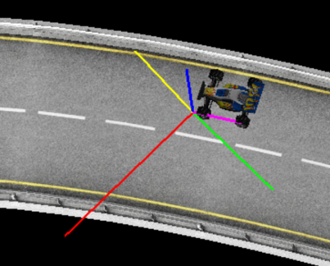
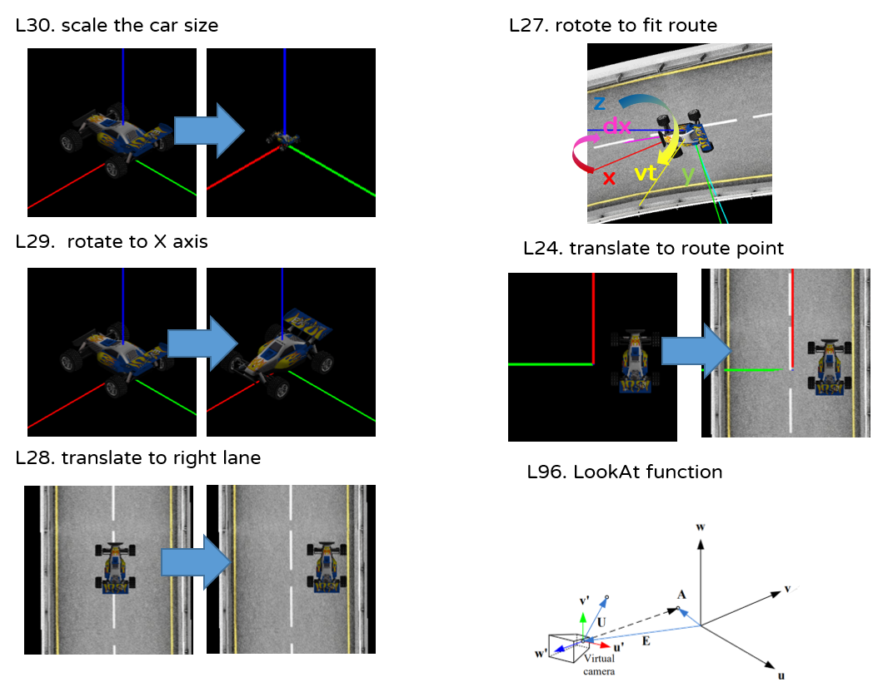
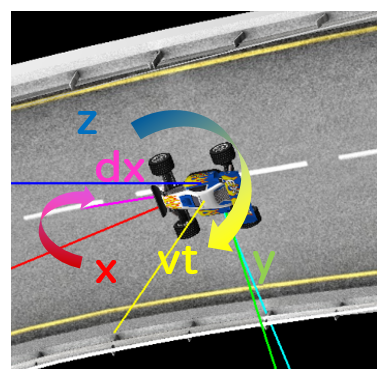

# Project3


### 1. File Import
```python
track = pywavefront.Wavefront('CarOnTrack/FullTrack.obj')
car   = pywavefront.Wavefront('CarOnTrack/SG_Car.obj')
route = np.genfromtxt('CarOnTrack/RoutWnormal.xyz', delimiter=' ')
```
<b>A. </b> use pywavefront.Wavefront to import obj file<br>
<b>B. </b>  `visualization.draw` to display it<br>
```python
glMatrixMode(GL_MODELVIEW)
glEnable(GL_LIGHTING)       
midLookAt(*(route[angle-1,0:2]+2*route[angle-1,3:5]),28,*route[angle,:3],0,0,1)
glPushMatrix() 
visualization.draw(track) # <-
glPopMatrix()
car_transformation()
glPushMatrix()
visualization.draw(car) # <-
glPopMatrix()
glDisable(GL_LIGHTING)
```
<b>C. </b>  use np to import xyz file, return numpy.ndarray<br>
there are three information about it：<br>
v(t) ：the car location on this point (t=t)<br>
v(t-1)：the car location on last point (t=t-1)<br>
dv ：the vector between v(t) v(t-1) two point<br>
vt(t) ：the car's normal vector on this point (t=t)<br>
<br>
```python
global v,v_1,vt,dv
v   = route[angle,:3]
v_1 = route[angle-1,:3]
vt  = route[angle,3:]
dv = v - v_1
dv = dv / np.linalg.norm(dv)
```
### 2. count from 0 to max of route point(351) and routine
```python
global angle
angle = (angle + 1) % route.shape[0]
```
### 3. Transmation matrix for car (L48~55)
```python
def car_transformation():
    M = np.identity(4)									# identity matrix I
    M = np.dot(M,midTranslated(*v))						# translate to route point
    vec = np.cross(vt,dv)
    vec = vec / np.linalg.norm(vec)
    M = np.dot(M,midRotated(dv,vec,vt))					# rotate to fit route
    M = np.dot(M,midTranslated(0,-4.8,1))				# translate to right lane
    M = np.dot(M,midRotated([0,1,0],[-1,0,0],[0,0,1]))	# rotate to X axis 
    M = np.dot(M,midScaled(0.2,0.2,0.2))				# scale the car size
    M = list(M.T.flatten())
    glMultMatrixf(M)
```
<br>

<b>A. </b> Line.96 Camera control (=gluLookAt)
```python
def midLookAt(eyex,eyey,eyez,centerx,centery,centerz,upx=0,upy=1,upz=0):
	w = np.array([eyex,eyey,eyez])-np.array([centerx,centery,centerz])
	w = w / np.linalg.norm(w)
	U = np.array([upx,upy,upz])
	u = np.cross(U,w)	
	u = u / np.linalg.norm(u)
	v = np.cross(w,u)
	M = [ 
			[u[0], v[0], w[0], eyex],
			[u[1], v[1], w[1], eyey], 
			[u[2], v[2], w[2], eyez],
			[  0.,   0.,   0.,   1.]
		]	
	M = list(np.linalg.inv(M).T.flatten())
	glLoadMatrixf(M)
```

<b>B. </b>Line.27 how car rotate to fit route<br>
dx = v(t) – v(t-1) 轉向 x 軸：<br>
vt (normal vector) 轉向 z 軸：<br>
vt, dv 的外積轉向 y 軸：<br>
```python
    vec = np.cross(vt,dv)
    vec = vec / np.linalg.norm(vec)
    M = np.dot(M,midRotated(dv,vec,vt))					# rotate to fit route
```
<br>

<b>C. </b>Rotate Matrix
```python
def midRotated(u,v,w):
	M = np.array([  
			[u[0], v[0], w[0], 0.],
			[u[1], v[1], w[1], 0.], 
			[u[2], v[2], w[2], 0.],
			[  0.,   0.,   0., 1.]
		])
	return M
```


### 4. Result
<br>
