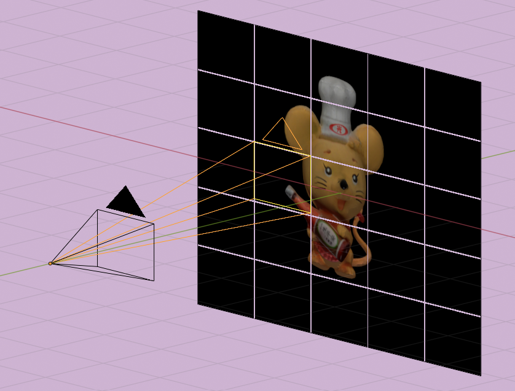

# Project4 - Image Stitching

Combine 100 small images(800x600) to one huge image(8000x6000) so that we can render the Ultra-high Resolution Pictures.<br>
Like the schematic below.

<br>

## Package

### Numpy

Use `Numpy.vstack` to combine in row, 
like **Line 64** in  `Project4.py`
```python 
img_buffer2.append(np.vstack(img_buffer[i*amplify:i*amplify+amplify][::-1])) # combine row 
```

Use `Numpy.hstack` to combine in row, 
like **Line 99** in  `Project4.py`
```python 
image =  np.hstack(img_buffer2) # combine column
```

### OpenCV2


 Use `cv2.imwrite` to save image,
 like **Line 100** in `Project4.py`
 ```python 
cv2.imwrite('output/'+mode+'_'+name+'.JPG',image)  
```

Read image,
like **Line 58** in `Project4.py`
```
def save_pic():
    colorBuffer = (GLubyte * (windowWidth*windowHeight*3) )(0) # 1440000 == 800*600*3
    glReadPixels(0, 0, windowWidth, windowHeight, GL_BGR, GL_UNSIGNED_BYTE, colorBuffer)
    imgColorflip = np.fromstring(colorBuffer, np.uint8).reshape( windowHeight, windowWidth, 3 )
    imgColor = cv2.flip(imgColorflip, 0) 
    img_buffer.append(imgColor)	  #store in img_buffer
```
