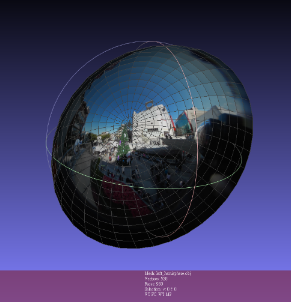

# Project5 - Mouse Control

## 1. obj file & mtl file 創建
假設沒有該文件，則創建文件(自動生成 obj file)，反之則開啟文件 
hemisphere.py 的 generate function 用來創建半圓.obj 檔與.mtl 檔 
每一圈切 32 點，有 16 圈， 
用四的點組成四邊形， 
中心點也用 32 點表示，方便程式化。 
 
## 2. 滑鼠控制
左鍵：拖曳旋轉場景，glLoadMatrixf 送入旋轉矩陣以旋轉 
右鍵：點擊回到原點(復歸)，reset 所有參數 
中鍵：滾動放大縮小，控制 glFrustum 的上下左右視野邊界 
## 3. 其他
利用 glViewport function 設定顯示範圍使兩視窗並排，並往左右各移 5pixel 使整體更像在 VR-display 看到的樣子。 
設置邊界由每次移動的總和 R0 設定，設定為只要 R0 與原點的距離超過一定數值便不能移動， 
但放大縮小會影響原點到邊界的距離，所以需要乘以與放大倍率有關的數值， 
最後調適出來是乘以放大倍率 zoom0.2較符合實際情況。 

## 4. 結果
 
