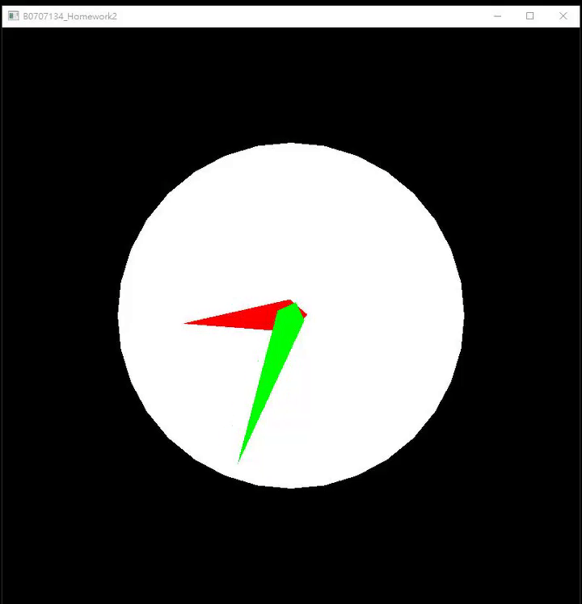
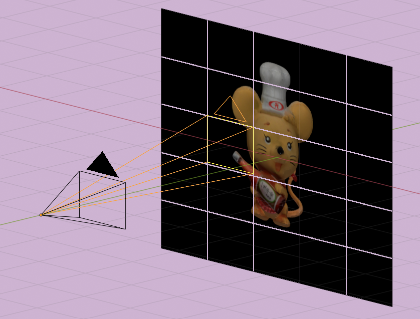

# Computer_Graphics
- [Project 1](#pro1) - Data structure of 3D model
- [Project 2](#pro2) - Transformations: Translation, Rotation, and Scaling of 3D model
- [Project 3](#pro3) - Camera & Object Control
- [Project 4](#pro4) - Image Stitching
- [Project 5](#pro5) - Mouse Control

## 
[Project 1](Project1) - Data structure of 3D model

<b>Demo：Oreo Box</b> 
 
👉 [Website Link](https://HsuShihHsueh.github.io/Computer_Graphics/Project1/oreo.html)

## 
[Project 2](Project2) - Transformations of 3D model

<b>Demo：Clock Render by openGL</b> 
 
👉 [Colab Link](https://colab.research.google.com/github/HsuShihHsueh/Computer_Graphics/blob/main/Project2/ClockByOpenGL.ipynb)

## 
[Project 3](Project3) - Camera & Object Control

<b>Demo：Making a racing car animation</b> 
 

## 
[Project 4](Project4) - Image Stitching

<b>Demo：Render Ultra-high Resolution Pictures </b> 
 

## 
[Project 5](Project5) - Mouse Control

<b>Demo：Render the Stereo-VR View of Two Fish-eye Images</b> 
 
